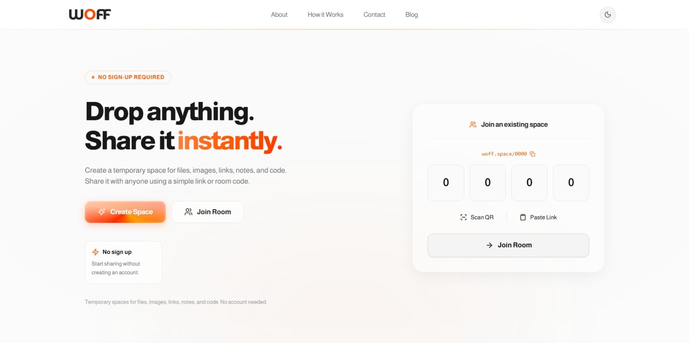
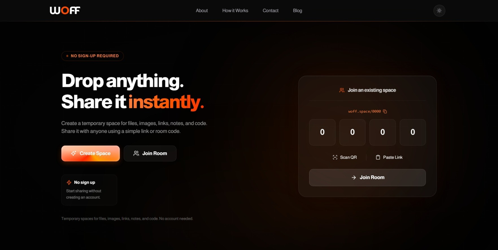

<div align="center">

# 🟠 Woff Space

**Instant sharing for files, notes, images, and code — no sign-up required.**

[](https://woff.space)
[](https://nextjs.org)
[](https://supabase.com)
[](https://www.typescriptlang.org)

</div>

<div align="center">
  
</div>
<br/>
<div align="center">
  
</div>

---

## 📖 Overview

**Woff Space** is an instant sharing platform. Create a room, add files, images, notes or code, and share its code or invitation link. New rooms have no time limit; owners can choose a deadline, change the code, close code joining, or revoke recipient access. Basic sharing and receiving work without signup. Optional verified sender accounts organize client handoffs; paid checkout stays gated until merchant, storage and hosting setup is complete.

The Free release uses the existing production Supabase and Vercel projects. Email sign-in was enabled after real confirmation delivery, account conversion and browser-room transfer checks on October 4. The October 7 update includes refreshed sign-in/sign-up screens, a complete checkout interface, and simpler room access controls; its current verification and deployment status is recorded in [launch readiness](docs/launch-readiness.md). Follow [release steps](docs/release-steps.md), [Pro checkout setup](docs/pro-checkout-setup.md), and [local database verification](supabase/tests/README.md) for setup details and migration-history mapping. The owner explicitly omitted cloud staging and a backup for this release; live payments remain closed.

🔗 **Live**: [https://woff.space](https://woff.space)

---

## 🛠️ Tech Stack

| Layer               | Technology                                                                                    |
| ------------------- | --------------------------------------------------------------------------------------------- |
| **Framework**       | [Next.js 15](https://nextjs.org) (App Router)                                                 |
| **Language**        | [TypeScript 5](https://www.typescriptlang.org)                                                |
| **Styling**         | [Tailwind CSS 3](https://tailwindcss.com)                                                     |
| **UI Components**   | [Radix UI](https://www.radix-ui.com) + [ShadCN/UI](https://ui.shadcn.com)                     |
| **Database & Auth** | [Supabase](https://supabase.com) (PostgreSQL + Storage + RLS)                                 |
| **Animations**      | [Framer Motion](https://www.framer.com/motion/)                                               |
| **Icons**           | [Lucide React](https://lucide.dev) + [React Icons](https://react-icons.github.io/react-icons) |
| **Deployment**      | [Vercel](https://vercel.com)                                                                  |

---

## ✨ Features

- **Instant Spaces** — Create a shareable space in one click, no sign-up
- **Room Sharing** — New rooms have open four-digit codes and no expiry; owners can change or disable code access, set a visible deadline, and revoke recipient access. Historical rooms keep their previous settings until their owner changes them.
- **Multi-Content Support** — Share text, images, files, PDFs, and code snippets
- **Rich Note Editor** — TipTap editor with Markdown shortcuts, versioned autosave, and offline drafts
- **Resumable Uploads** — Real byte progress, cancellation, retry, and atomic multi-file publishing
- **QR Code Sharing** — Generate and scan QR codes to share/join spaces
- **Anonymous Sharing** — Supabase Auth establishes guest ownership; verified sender sign-in is optional
- **Owner Recovery** — A recovery key can restore room ownership after a session is lost
- **Dark/Light Theme** — System-aware theme with manual toggle
- **Online Notepad** — Dedicated notepad with shareable link
- **SEO Optimized** — Structured data, meta tags, sitemap, and blog
- **Responsive Design** — Works across desktop, tablet, and mobile
- **Private Aggregate Metrics** — First-party daily counters contain no room codes, tokens, filenames or note content; third-party tracking is disabled
- **Sender Handoffs** — Dashboard search, room names, welcome instructions, read-only delivery and one reusable settings template
- **Gated Pro Pilot** — Checkout review, hosted payment, confirmation state, customer billing portal and server-verified entitlements; live sales open only after provider, storage and commercial-hosting checks
- **Portable Note Exports** — Browser Print / Save as PDF and ZIPs containing HTML notes with embedded images

---

## 📦 Dependencies

### Core

| Package                 | Purpose                          |
| ----------------------- | -------------------------------- |
| `next`                  | React framework (App Router)     |
| `react` / `react-dom`   | UI library                       |
| `typescript`            | Type safety                      |
| `@supabase/supabase-js` | Database, auth, and file storage |

### UI & Styling

| Package                        | Purpose                                                          |
| ------------------------------ | ---------------------------------------------------------------- |
| `tailwindcss`                  | Utility-first CSS                                                |
| `@radix-ui/*`                  | Accessible primitives (Dialog, Dropdown, Popover, Tooltip, etc.) |
| `class-variance-authority`     | Component variant management                                     |
| `clsx` + `tailwind-merge`      | Class name utilities                                             |
| `framer-motion`                | Animations and transitions                                       |
| `lucide-react` / `react-icons` | Icon libraries                                                   |
| `next-themes`                  | Theme management                                                 |
| `sonner`                       | Toast notifications                                              |

### Utilities

| Package                           | Purpose                    |
| --------------------------------- | -------------------------- |
| `nanoid`                          | Short unique ID generation |
| `qrcode` / `qr-scanner`           | QR generation and scanning |
| `jszip`                          | Bounded browser ZIP exports |
| Browser Print                    | Rich note PDF export       |

### Dev

| Package                         | Purpose            |
| ------------------------------- | ------------------ |
| `eslint` + `eslint-config-next` | Linting            |
| `playwright`                    | End-to-end testing |
| `postcss`                       | CSS processing     |

---

## 🚀 Getting Started

### Prerequisites

- **Node.js** 18+
- **npm** (or yarn/pnpm)
- **Supabase** account ([supabase.com](https://supabase.com))

### Installation

1. **Clone the repository**

```bash
git clone https://github.com/RizviBR0/Woff.git
cd Woff
```

2. **Install dependencies**

```bash
npm install
```

3. **Configure environment variables**

Create a `.env.local` file in the root:

```env
NEXT_PUBLIC_SUPABASE_URL=your_supabase_url
NEXT_PUBLIC_SUPABASE_ANON_KEY=your_supabase_anon_key
SUPABASE_SERVICE_ROLE_KEY=your_server_only_secret_or_legacy_service_role_key
CRON_SECRET=a_long_random_secret
NEXT_PUBLIC_SITE_URL=http://localhost:3000
```

4. **Set up the database**

Enable anonymous sign-ins, then apply every SQL file in
`supabase/migrations` in filename order. Together they install the tables,
restricted RPCs, private Storage policies, Row Level Security, advisor
hardening, optimized indexes, and the legacy-file compatibility migration.

5. **Start the dev server**

```bash
npm run dev
```

Open [http://localhost:3000](http://localhost:3000) in your browser.

<div align="center">

Made with 🧡

</div>
