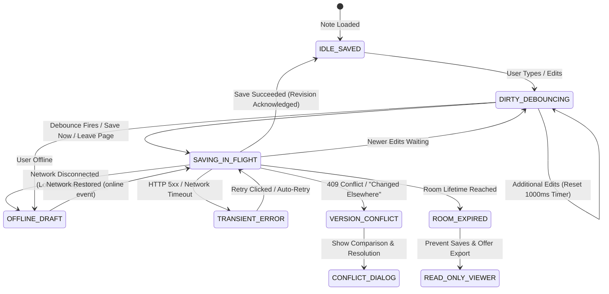
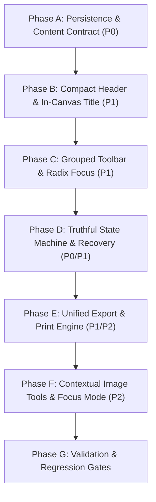

# Woff Note Editor Improvement Plan & Technical Specification

> **Status:** Completed & Verified Specification  
> **Date:** October 2026  
> **Origin:** Initial assessment by GPT 6.1 Sol for the desktop screenshot (`media_1790871981538.png`); verified, audited, and completed with comprehensive engineering specifications against the active codebase.  
> **Key Touchpoints:** [`components/note-editor.tsx`](file:///e:/Woff/components/note-editor.tsx), [`lib/actions.ts`](file:///e:/Woff/lib/actions.ts), [`app/globals.css`](file:///e:/Woff/app/globals.css), [`components/activity-sidebar.tsx`](file:///e:/Woff/components/activity-sidebar.tsx).

---

## 1. Executive Summary & Design Principles

Woff is built on a fast, account-free, ephemeral room-sharing model. Notes created in Woff serve two primary purposes:
1. **Quick temporary notes & scratchpads** shared instantly within a 4-digit room.
2. **Distraction-free rich documents** containing checklists, formatted text, code snippets, and embedded images.

### The Problem Observed in the Screenshot
The provided screenshot depicts a dark-themed desktop editor suffering from severe cognitive overload, layout fragmentation, and visual friction:
- **Button competition:** Three prominent buttons (`Download`, `Share`, `Save`) compete at top-right. `Save` is a bright, solid-white button that dominates the UI despite autosave already being active, overshadowing the primary product action: `Share`.
- **Navigation redundancy:** A back arrow `←` and a `Room 1209` pill sit side-by-side as duplicate clickable links back to the space.
- **Disconnected document title:** The note title is squeezed into a small text box in the application header, completely detached from the writing surface below.
- **Horizontal toolbar sprawl:** 19 separate buttons (mode switch, undo, redo, 4 marks, 2 headings, 3 lists, quote, code, 3 alignments, link, image) sit in a rigid horizontal bar. This causes visual fatigue on desktop and overflows aggressively on mobile.
- **Harsh writing surface:** The dark theme wraps the text area in a high-contrast bordered card with a massive black void, rather than providing an inviting, calm, page-like canvas.
- **Duplicate status:** "Saved in this space" appears in both the header and the footer.
- **Didactic placeholder:** The empty note displays an instruction manual (`Start writing.. Markdown shortcuts like "# " and "- " work here.`) in place of a clean, subtle invitation to write.

```
CURRENT SCREENSHOT LAYOUT (FLAWED):
+----------------------------------------------------------------------------------------------------+
| [<-] [Room 1209]  [ Untitled Note               ]        Saved in this space  (*) [Download] [Share] [ SAVE ] |
+----------------------------------------------------------------------------------------------------+
| [Rich|Raw] [U][R] | [B][I][U][S] | [H1][H2] | [•][1.][v] | ["][<>] | [L][C][R] | [Link] [Img]          |
+----------------------------------------------------------------------------------------------------+
|  +----------------------------------------------------------------------------------------------+  |
|  | Start writing.. Markdown shortcuts like "# " and "- " work here.                             |  |
|  |                                                                                              |  |
|  |                                (Empty dark bordered box)                                     |  |
|  |                                                                                              |  |
|  +----------------------------------------------------------------------------------------------+  |
| Saved in this space                                                             0 words · 0 chars   |
+----------------------------------------------------------------------------------------------------+
```

### Core Design Principles for the Redesign
1. **Document-First Canvas:** Treat the note as a real document. Place the editable title inside the canvas above the body text (in the style of Notion, Bear, and Apple Notes).
2. **Promote Sharing, Automate Saving:** Autosave quietly and reliably. Remove the prominent white Save button in favor of a subtle, dynamic sync status badge with manual fallback (`Ctrl+S` / Note Options). Make `Share` the clear primary call to action.
3. **Grouped, Context-Aware Toolbar:** Collapse 19 individual buttons into 6 logical groups with dropdown menus (`Text Style`, `Lists`, `Insert`, `More`). Expose contextual tools (image alignment, alt text) only when an item is selected.
4. **Calm, Borderless Writing Surface:** Remove the harsh card container border. Use a centered 768px reading column with ambient contrast and generous typing cushion below the last paragraph.
5. **Truthful & Durable State Machine:** Never claim a note is "Saved" remotely if changes are still pending in debounce, if the device is offline, or if a sync error occurred. Provide persistent local draft recovery and safe version conflict handling.

---

## 2. Comprehensive Codebase & Screenshot Audit

A thorough examination of the running code and test suites confirms the exact architectural realities and reveals several hidden bugs that must be resolved in tandem with the visual redesign.

### Verified Architecture & Source Behaviors

| Capability | Current Source Behavior | Code Location | Finding / Required Improvement |
| :--- | :--- | :--- | :--- |
| **Autosave Engine** | 1000ms debounce timer on input. Serialized via `saveQueueRef` promise chain. Sends version number for optimistic concurrency. | [`components/note-editor.tsx`](file:///e:/Woff/components/note-editor.tsx#L459-L522) | Works well in standard flow, but version conflict halts future saves and displays a transient toast without a recovery dialog. |
| **Local Draft Storage** | Debounced (300ms) write to `localStorage` key `woff-note-draft:${slug}` with title, html, json, and timestamp. | [`components/note-editor.tsx`](file:///e:/Woff/components/note-editor.tsx#L441-L457) | Draft write exceptions (quota full/incognito) are swallowed silently. Restoring is offered via a 10s toast that misses title-only changes. |
| **HTML Sanitizer** | Server-side sanitization using `sanitize-html` before database persistence. | [`lib/actions.ts`](file:///e:/Woff/lib/actions.ts#L101-L128) | **CRITICAL BUG (P0):** `allowedAttributes.li` only allows `data-checked`, NOT `data-type`. Tiptap's `TaskItem` outputs `<li data-type="taskItem">`, causing task items to lose their type on reload. Additionally, `allowedStyles` for `text-align` is missing for `p, h1, h2, h3`, stripping all text alignment on save/reload. |
| **Markdown Fidelity** | Turndown handles HTML -> Markdown; `marked` handles Markdown -> HTML. | [`components/note-editor.tsx`](file:///e:/Woff/components/note-editor.tsx#L247-L267) | Turndown lacks rules for underline, strikethrough, image alignment/dimensions, and alignment marks. Mode switching destructively replaces rich text even on inspection. |
| **PDF Generation** | Room sidebar exports PDF by extracting `tempDiv.textContent` and rendering via `jsPDF` with Helvetica. | [`components/activity-sidebar.tsx`](file:///e:/Woff/components/activity-sidebar.tsx#L700-L750) | Completely strips formatting, images, headings, lists, and breaks on non-Latin scripts (e.g. Bangla). Missing from the note editor itself. |
| **Room Navigation** | Independent `ArrowLeft` button and `Room {slug}` badge both link to `/${space_slug}`. | [`components/note-editor.tsx`](file:///e:/Woff/components/note-editor.tsx#L1014-L1031) | Redundant double click targets. Breadcrumb should be unified into a single clickable element: `← Room 1209`. |
| **Sharing Model** | Generates note URL, displays QR code via `qrcode` library, and provides copy button. | [`components/note-editor.tsx`](file:///e:/Woff/components/note-editor.tsx#L1317-L1335) | Room notes are viewable by anyone with the link, but only editable by the creator (`is_owner`). Does not clearly state room expiry limits. |
| **Image Pipeline** | Uploads image via storage intent, places inline ProseMirror decoration placeholder with retry, and updates image attributes. | [`components/note-editor.tsx`](file:///e:/Woff/components/note-editor.tsx#L83-L198) | Placeholder and retry work well, but image alignment buttons are awkwardly placed in the global toolbar rather than contextually on the image. Alt text is not editable. |

---

## 3. Information Architecture & UI Wireframes

### Recommended Target Layout (Compact Mode - Default)

```
DESKTOP WIREFRAME (COMPACT DEFAULT):
+----------------------------------------------------------------------------------------------------+
| [← Room 1209]                                        Saved · Waiting to sync  [  Share  ]  [ ... ] |
+----------------------------------------------------------------------------------------------------+
| [Undo][Redo] | [Paragraph v] | [B][I] | [Lists v] | [Link] | [Insert v] | [More v]                 |
+----------------------------------------------------------------------------------------------------+
|                                                                                                    |
|                                       Untitled Note                                                |
|                                                                                                    |
|            Start writing... Use Markdown shortcuts like "# " for headers or "- " for lists.       |
|                                                                                                    |
|            Lorem ipsum dolor sit amet, consectetur adipiscing elit. Sed do eiusmod                 |
|            tempor incididunt ut labore et dolore magna aliqua.                                     |
|                                                                                                    |
|                                                                                                    |
|                                                                                                    |
|                                                                                                    |
+----------------------------------------------------------------------------------------------------+
|                                                                                 142 words · 890 ch |
+----------------------------------------------------------------------------------------------------+
```

### Focus Mode Wireframe (Zen Writing View)

Focus mode is toggled via `Note Options (...) → Focus mode` or `Ctrl/Cmd + Shift + F` / `F11`. It removes non-essential chrome while keeping an unobtrusive top hover bar to exit or format.

```
FOCUS MODE WIREFRAME:
+----------------------------------------------------------------------------------------------------+
| (Header auto-hides; appears on mouse move to top edge with: [Exit Focus (Esc)]  [Save Status] [...])|
+----------------------------------------------------------------------------------------------------+
|                                                                                                    |
|                                                                                                    |
|                                       Untitled Note                                                |
|                                                                                                    |
|            The document is completely centered in the viewport with zero distractions.             |
|            The toolbar can float or dock subtly on text selection.                                |
|                                                                                                    |
|                                                                                                    |
+----------------------------------------------------------------------------------------------------+
```

### Mobile Wireframe (375px – 430px Viewports)

On mobile devices, the header is streamlined to 48px, the title lives naturally in the document flow, and the toolbar adapts to touch:

```
MOBILE VIEWPORT WIREFRAME:
+-------------------------------------------+
| [← Room 1209]      (•) Saved  [Share] [...]|
+-------------------------------------------+
| [Style v]  [B]  [I]  [Lists v]  [+]  [...] |  <-- Sticky or scrollable touch bar
+-------------------------------------------+
|                                           |
|  Untitled Note                            |
|                                           |
|  Start typing here...                     |
|                                           |
|                                           |
+-------------------------------------------+
| 45 words                                  |
+-------------------------------------------+
```

---

## 4. Option Placement & Menu Architecture

To avoid clutter and confusion, controls are split between two distinct menus with unambiguous labels and iconography:
1. **Note Options (`...` in Header):** Global document actions, exports, view settings, and metadata.
2. **More Formatting (`...` in Toolbar):** Secondary typography marks, block alignments, and clear formatting.

### Complete Options Mapping Table

| Item / Action | Proposed Location | Trigger / UI Type | Icon / Visual | Keyboard Shortcut | Rationale & Behavior |
| :--- | :--- | :--- | :--- | :--- | :--- |
| **Room Navigation** | Header Left | Unified button | `ArrowLeft` + "Room 1209" | `Alt + Left` | Eliminates duplicate back arrow and pill button. |
| **Note Title** | In-Canvas (Top of Body) | Borderless auto-resizing text field | Large Display font | `Enter` moves to body | Makes title an integral part of the document canvas. |
| **Save Status Badge** | Header Right | Status badge with tooltip | `Check` / `Loader2` / `CloudOff` | — | Single truthful indicator (Saved, Saving…, Offline, Conflict). |
| **Share Note** | Header Right | Primary Button | `Share2` + "Share" | — | The defining feature of Woff; given visual primacy over Save. |
| **Note Options** | Header Right | Dropdown Menu (`...`) | `MoreHorizontal` | — | Houses file actions, view settings, and document metadata. |
| **Save Now** | Note Options | Menu Item | `Save` | `Ctrl/Cmd + S` | Accessible manual escape hatch; immediately flushes pending draft. |
| **Export Submenu** | Note Options | Cascading Submenu | `Download` | — | Groups Markdown (`.md`), Plain Text (`.txt`), and Print / PDF. |
| **Print / PDF** | Note Options → Export | Submenu Item | `Printer` / `FileText` | `Ctrl/Cmd + P` | Native vector print-to-PDF preserving styles, images, and Bangla. |
| **Editor Mode Switch**| Note Options | Segmented Item / Toggle | `FileText` / `Code2` | `Ctrl/Cmd + /` | Removes mode toggle from main toolbar; inspects raw markdown safely. |
| **Appearance / Theme**| Note Options | Submenu Item | `Sun` / `Moon` | — | Integrates with global NextThemes provider. |
| **Focus Mode** | Note Options | Toggle Item | `Maximize2` | `Ctrl+Shift+F` / `F11` | Fullscreen zen writing mode with minimal chrome. |
| **Document Width** | Note Options | Toggle Item | `Columns` | — | Switches between Standard (768px) and Wide (1024px) for code/tables. |
| **Note Information** | Note Options | Dialog / Popover | `Info` | — | Shows word/character count, created/updated date, room expiry timer. |
| **Lock Note** | Note Options | Menu Item | `Lock` | — | Available to owner to set passcode protection. |
| **Undo / Redo** | Toolbar Left | Toolbar Buttons | `Undo2`, `Redo2` | `Ctrl+Z`, `Ctrl+Y` | Standard desktop actions with disabled visual states. |
| **Text Style** | Toolbar Group 1 | Dropdown Menu | Current block label `v` | `Ctrl+Alt+0..3` | Normal Text, Heading 1, Heading 2, Heading 3. |
| **Bold / Italic** | Toolbar Group 2 | Toggle Buttons | `Bold`, `Italic` | `Ctrl+B`, `Ctrl+I` | High-frequency inline formatting marks. |
| **Lists Group** | Toolbar Group 3 | Dropdown Menu | `List` `v` | `Ctrl+Shift+7..9` | Bullet List, Numbered List, Checklist / Task List. |
| **Insert Link** | Toolbar Group 4 | Popover / Dialog | `Link2` | `Ctrl/Cmd + K` | Opens link editor; shows edit/remove card when cursor is in link. |
| **Insert Menu** | Toolbar Group 5 | Dropdown Menu | `Plus` / `ImagePlus` `v` | — | Image upload, Blockquote, Code block, Horizontal divider. |
| **More Formatting** | Toolbar Right | Dropdown Menu (`...`) | `MoreHorizontal` | — | Underline, Strikethrough, Inline Code, Alignments, Clear Formatting. |
| **Contextual Image Bar**| Floating Bubble on Image| Contextual Toolbar | `AlignLeft`, `Center`, `Right`, `Tag`, `Trash` | — | Appears only when an image is clicked; includes Alt Text editor. |
| **Document Stats** | Document Footer | Subtle text | Text | — | Word and character counts, unobtrusively placed at bottom-right. |

---

## 5. Technical Specifications: Content Fidelity & Sanitization (P0)

### 5.1 HTML Sanitizer Whitelist Repair (`lib/actions.ts`)

#### Root Cause Analysis
In [`lib/actions.ts`](file:///e:/Woff/lib/actions.ts#L101-L128), `sanitizeNoteHtml` utilizes `sanitize-html`. The configuration contains two fatal omissions:
1. `allowedAttributes.li` only permits `["data-checked"]`. TipTap's `@tiptap/extension-task-item` renders `<li data-type="taskItem" data-checked="...">`. Because `data-type` is stripped, on page refresh TipTap fails to recognize the item as a checklist item and renders it as an ordinary bullet list!
2. `allowedAttributes` does not allow `style` or `class` on headings (`h1`, `h2`, `h3`) or paragraphs (`p`). TipTap's `@tiptap/extension-text-align` applies inline CSS (e.g. `<p style="text-align: right">`). On save, the sanitizer strips the `style` attribute entirely, destroying text alignment.

#### Code Fix Specification
Update `sanitizeNoteHtml` in `lib/actions.ts`:

```typescript
// lib/actions.ts
function sanitizeNoteHtml(value: string): string {
  return sanitizeHtml(value, {
    allowedTags: allowedHtmlTags,
    allowedAttributes: {
      a: ["href", "target", "rel"],
      img: ["src", "alt", "title", "width", "height", "data-align"],
      span: ["data-type", "data-checked"],
      div: ["data-type"],
      li: ["data-checked", "data-type"], // FIX: Permit data-type on li for task lists
      ul: ["data-type"],
      ol: ["type", "start"],
      input: ["type", "checked", "disabled"],
      // FIX: Permit text-align style on block elements
      p: ["style", "class"],
      h1: ["style", "class"],
      h2: ["style", "class"],
      h3: ["style", "class"],
      blockquote: ["style", "class"],
    },
    allowedStyles: {
      "*": {
        // Strictly restrict style attributes to text alignment only
        "text-align": [/^left$/, /^right$/, /^center$/, /^justify$/],
      },
    },
    allowedSchemes: ["http", "https", "mailto"],
    allowedSchemesByTag: {
      img: ["http", "https", "data"],
    },
    transformTags: {
      a: (_tagName, attribs) => ({
        tagName: "a",
        attribs: {
          ...attribs,
          target: "_blank",
          rel: "noopener noreferrer nofollow",
        },
      }),
    },
  });
}
```

### 5.2 Turndown Markdown Serialization Improvements

#### Root Cause Analysis
The current Turndown setup only defines a single rule for `taskListItem`. It drops:
- `<u>` tags (Underline is lost or converted to plain text).
- `<s>` / `<del>` tags (Strikethrough is often dropped).
- Paragraph alignments (lost without conversion).
- Resized image attributes (`width`, `height`, `data-align`).

#### Code Fix Specification
Configure Turndown with enhanced rules in `components/note-editor.tsx`:

```typescript
// Enhanced Turndown configuration
const turndownService = new TurndownService({
  headingStyle: "atx",
  codeBlockStyle: "fenced",
  bulletListMarker: "-",
  emDelimiter: "_",
});

// 1. Task list item rule
turndownService.addRule("taskListItem", {
  filter: (node) =>
    node.nodeName === "LI" &&
    (node.getAttribute("data-type") === "taskItem" ||
      node.classList.contains("task-list-item")),
  replacement: (content, node) => {
    const isChecked =
      (node as HTMLElement).getAttribute("data-checked") === "true" ||
      node.querySelector('input[type="checkbox"]:checked') !== null;
    return `${isChecked ? "- [x]" : "- [ ]"} ${content.trim()}\n`;
  },
});

// 2. Strikethrough rule
turndownService.addRule("strikethrough", {
  filter: ["s", "del", "strike"],
  replacement: (content) => `~~${content}~~`,
});

// 3. Underline rule (HTML preserved for markdown compatibility)
turndownService.addRule("underline", {
  filter: ["u", "ins"],
  replacement: (content) => `<u>${content}</u>`,
});

// 4. Image with dimensions and alignment
turndownService.addRule("extendedImage", {
  filter: "img",
  replacement: (_content, node) => {
    const element = node as HTMLImageElement;
    const alt = element.getAttribute("alt") || "";
    const src = element.getAttribute("src") || "";
    const width = element.getAttribute("width");
    const align = element.getAttribute("data-align");

    // Standard markdown fallback if no special attributes
    if (!width && !align) {
      return ``;
    }
    // HTML tag preservation for accurate geometry
    const styleAttr = align ? ` style="text-align: ${align}"` : "";
    const widthAttr = width ? ` width="${width}"` : "";
    return ``;
  },
});
```

### 5.3 Non-Destructive Raw Mode Switching

#### Problem
Currently, toggling to Raw Markdown converts the editor HTML into Markdown and puts it in a textarea. Switching back calls `editor.commands.setContent(html)` unconditionally. This pushes a new transaction to ProseMirror, dirties the document, resets undo history, and can reformat subtle whitespace even if the user made zero edits.

#### Solution: Baseline Diffing
Maintain `rawBaselineRef.current`. When toggling from Rich to Raw, record the generated markdown as the baseline. When the user switches back:
- If `rawContent === rawBaselineRef.current`, **do nothing** (do not reload editor content or dispatch a transaction).
- If `rawContent !== rawBaselineRef.current`, parse markdown with `marked.parse()`, sanitize, update TipTap, and mark dirty.

---

## 6. Truthful State Machine & Concurrency Architecture

### 6.1 Finite State Machine (FSM) Specification

The editor must transition between explicit states to guarantee no data loss and eliminate misleading "Saved" claims.



### 6.2 State Definitions, UI Representations & User Actions

| State | Badge Text | Badge Visual | Description | Available User Actions |
| :--- | :--- | :--- | :--- | :--- |
| `IDLE_SAVED` | "Saved in this space" | Subtle text, check icon | All client edits match the confirmed remote server revision. | Share, Export, Edit |
| `DIRTY_DEBOUNCING` | "Saving changes…" | Amber dot / subtle text | Edits made within the last 1000ms; waiting to fire network call. | Keep writing, Save Now (`Ctrl+S`) |
| `SAVING_IN_FLIGHT` | "Saving…" | Small spinning loader | HTTP request actively transmitting snapshot to Supabase. | Wait, Cancel not needed |
| `OFFLINE_DRAFT` | "Saved on this device" | CloudOff icon, gray | Device is offline. Edits successfully written to `localStorage`. | Reconnect to sync, Export backup |
| `TRANSIENT_ERROR` | "Couldn't save · Retry" | Red text, clickable button | Network timeout or temporary 500 error. Local draft preserved. | Click **Retry**, Save Now, Export |
| `VERSION_CONFLICT` | "Conflict detected" | Red warning badge | Note was edited in another tab or device (optimistic version mismatch). | Click **Resolve Conflict** |
| `ROOM_EXPIRED` | "Space expired" | Muted lock icon | 4-digit room has reached its TTL. Server forbids modifications. | Export Markdown, Copy Text |
| `READ_ONLY_VIEWER` | "Read only" | Muted badge | Viewer does not own the note (`!is_owner`). | Copy, Download, Share link |

### 6.3 Version Conflict Handling Dialog

When the server returns `"This note changed elsewhere. Reload before saving again."`:
1. Do **not** overwrite the remote note.
2. Do **not** discard the user's in-memory edits.
3. Open `NoteConflictDialog` offering 3 clear choices:
   - **Keep Local Changes (Overwrite):** Fetches the latest remote version number and forces a save with the local content.
   - **Load Remote Version:** Backs up the local draft to a downloaded `.md` file, then reloads the remote document.
   - **Save as New Note:** Creates a new note in the same room with the user's local content.

### 6.4 Persistent Recovery Banner (Replacing 10-Second Toast)

The current 10-second transient toast is replaced by a persistent, non-intrusive banner rendered directly above the document canvas:

```
+----------------------------------------------------------------------------------------------------+
| [i] An unsaved draft from this browser (10 minutes ago) was found.     [ Restore Draft ]  [ Discard ] |
+----------------------------------------------------------------------------------------------------+
```

- **Detection condition:**
  `(draft.savedAt > note.updated_at) && (draft.title !== note.title || draft.html !== note.content)`
- **Behavior:**
  - Clicking **Restore Draft** loads the draft into TipTap, updates title, sets dirty state, and schedules an immediate autosave.
  - Clicking **Discard** removes the draft from `localStorage` and closes the banner.
  - The banner stays visible until explicitly acted upon.

---

## 7. Unified Export & Print-to-PDF Engine

### Current Problem
`components/activity-sidebar.tsx` contains a crude `jsPDF` script that strips all HTML tags with `tempDiv.textContent` and writes plain Helvetica text line-by-line. It completely drops:
- Headings, bold, italics, underline, lists, checkboxes, blockquotes, code blocks.
- All embedded images.
- Non-Latin scripts: **Bangla (বাংলা)** and Unicode characters render as broken glyphs (`????`) because `jsPDF` standard fonts lack Unicode glyph tables.

### Unified Export Architecture
Consolidate all export logic into a dedicated module: `lib/note-export.ts`.

#### Method 1: High-Fidelity Browser-Native Print-to-PDF (`window.print()`)
Instead of bundling large multi-megabyte Bengali font files into client-side `jsPDF`, the primary PDF path leverages the browser's native print engine with an optimized `@media print` stylesheet. This delivers:
1. **100% Vector Fidelity:** Exactly mirrors the TipTap typography scale, line heights, and margins.
2. **Native Unicode & Font Support:** Renders `var(--font-almarai)`, Bangla, emojis, and international scripts flawlessly using the operating system's font rasterizer.
3. **Image & Code Preservation:** Full resolution images with accurate alignment and syntax-highlighted code blocks.
4. **Clean Print Output:** Hides header, toolbar, footer, and theme toggles automatically.

```css
/* app/globals.css - Print Optimization */
@media print {
  body {
    background: white !important;
    color: black !important;
  }

  /* Hide application chrome */
  header,
  .sticky,
  .note-toolbar,
  .note-footer,
  .note-options-menu,
  button {
    display: none !important;
  }

  /* Expand canvas to full page */
  main,
  article,
  .note-editor-content {
    max-width: 100% !important;
    margin: 0 !important;
    padding: 0 !important;
    border: none !important;
    box-shadow: none !important;
  }

  /* Ensure page breaks avoid orphan headers */
  h1, h2, h3 {
    page-break-after: avoid;
    break-after: avoid;
  }

  img, pre, blockquote {
    page-break-inside: avoid;
    break-inside: avoid;
  }
}
```

#### Method 2: Structured File Downloads
- **Markdown (`.md`):** Formatted using the enhanced Turndown configuration.
- **Plain Text (`.txt`):** Formatted with clean whitespace and task markers (`[x]`).
- **Clipboard Actions:** Copy Markdown or Copy Formatted Rich Text for pasting directly into email, Slack, or Google Docs.

---

## 8. Selection-Preserving Toolbar Interaction Pattern

### Problem in Current Code
In React applications using Radix UI (`@radix-ui/react-dropdown-menu` or `@radix-ui/react-popover`), clicking a dropdown menu trigger or menu item normally shifts browser focus from the TipTap ProseMirror contenteditable element to the menu. When focus is lost, ProseMirror selection collapses or blurs, meaning formatting commands (like choosing "Heading 1" or "Bullet List") fail or apply to the wrong range.

### Architectural Solution
Every toolbar button, dropdown menu trigger, and dropdown item must implement the following event contracts:
1. **`onMouseDown={(e) => e.preventDefault()}`** on all buttons and triggers. This prevents the browser from transferring focus away from the editor DOM node.
2. **Radix Dropdown Menu Configuration:**
   - Set `modal={false}` on `<DropdownMenu>` so it does not trap focus or lock outside pointer events.
   - Set `onCloseAutoFocus={(e) => e.preventDefault()}` on `<DropdownMenuContent>` so closing the menu leaves cursor focus in the editor.
3. **Execute via Chained Commands:**
   Always use `editor.chain().focus().[command].run()` to re-assert ProseMirror focus with the existing selection intact.

---

## 9. Contextual Image Inspector Specification

Instead of cluttering the top toolbar with image alignment controls (which take up space even when no image is selected), implement a **Contextual Floating Bubble Menu** for images using TipTap's `BubbleMenu` or ProseMirror node selection.

```
IMAGE SELECTION BUBBLE MENU:
+-------------------------------------------------------------+
| [Align Left]  [Align Center]  [Align Right] | [Alt Text]  [🗑] |
+-------------------------------------------------------------+
               ▲
    +-----------------------+
    |                       |
    |    Selected Image     |
    |                       |
    +-----------------------+
```

### Features:
1. **Alignment:** One-click toggling between Left, Center, and Right alignment.
2. **Alt Text Editor:** Opens a clean dialog: "Edit image description" for screen readers and accessibility.
3. **Delete:** Removes the image node immediately (`Backspace` / delete button).
4. **Aspect Ratio Preservation:** Resizing handles on the four corners with min-width 80px and max-width 100%.

---

## 10. Phased Implementation Roadmap & Work Boundaries

### Phase Breakdown



### Detailed Phase Tasks & File Touchpoints

#### Phase A: Core Content Contract & Sanitizer Fixes (P0)
- **Goal:** Guarantee that saved notes preserve all formatting, task items, alignment, and markdown structures across reloads.
- **Tasks:**
  1. Modify `lib/actions.ts`: Update `sanitizeNoteHtml` to whitelist `li[data-type]`, `ul[data-type]`, and `style="text-align:..."` on block elements.
  2. Modify `components/note-editor.tsx`: Add Turndown rules for underline, strikethrough, extended image tags, and nested task lists.
  3. Modify `components/note-editor.tsx`: Implement baseline diffing in `handleSwitchMode` to make raw markdown inspection non-destructive.
- **Exit Gate:** Save note with checklists, right-aligned headings, and images -> hard reload -> all elements render with 100% fidelity.

#### Phase B: Compact Header & Document-First Canvas (P1)
- **Goal:** Modernize the page layout to eliminate visual clutter, establish the document-first canvas, and promote sharing.
- **Tasks:**
  1. Refactor Header in `components/note-editor.tsx`:
     - Merge `ArrowLeft` and `Room {slug}` into a single clickable breadcrumb link: `← Room {slug}`.
     - Move the note title input out of the header into the top of the document canvas.
     - Demote the prominent white `Save` button; replace with the subtle save status badge.
     - Position `Share` as the primary solid/styled button.
     - Add the `...` Note Options dropdown trigger.
  2. Redesign Document Canvas:
     - Remove the harsh bordered box (`rounded-xl border bg-background`).
     - Center the writing surface (`max-w-3xl mx-auto`) with seamless ambient background.
     - Set auto-growing title: `text-3xl sm:text-4xl font-bold tracking-tight outline-none mb-4`.
     - Set body placeholder: `Start writing…`.
     - Add 180px bottom typing cushion so the cursor is never at the screen edge.
- **Exit Gate:** Desktop and mobile layouts render without horizontal scroll or double status text; title edits update note state seamlessly.

#### Phase C: Grouped Toolbar & Dropdown Menus (P1)
- **Goal:** Replace the 19-button sprawl with a clean, responsive 6-group toolbar.
- **Tasks:**
  1. Build grouped toolbar components:
     - `Undo` / `Redo`
     - `Text Style` Dropdown (`Paragraph`, `H1`, `H2`, `H3`)
     - `Bold` / `Italic`
     - `Lists` Dropdown (`Bullet List`, `Numbered List`, `Task List`)
     - `Link` Trigger
     - `Insert` Dropdown (`Image`, `Quote`, `Code Block`, `Divider`)
     - `More Formatting` Dropdown (`Underline`, `Strikethrough`, `Inline Code`, `Align Left/Center/Right`, `Clear Formatting`)
  2. Implement selection-preservation handlers (`onMouseDown={(e) => e.preventDefault()}` and `modal={false}`) to guarantee zero focus loss.
- **Exit Gate:** Any formatting command can be applied to selected text from any dropdown without losing text selection.

#### Phase D: State Machine, Recovery Banner & Conflict Handling (P0/P1)
- **Goal:** Provide bulletproof save reliability, truthful status badges, and non-destructive conflict recovery.
- **Tasks:**
  1. Implement explicit state enum: `IDLE_SAVED`, `DIRTY_DEBOUNCING`, `SAVING_IN_FLIGHT`, `OFFLINE_DRAFT`, `TRANSIENT_ERROR`, `VERSION_CONFLICT`.
  2. Replace 10s toast with persistent `NoteRecoveryBanner` checking both title and content differences.
  3. Implement `NoteConflictDialog` for 409 optimistic lock errors.
  4. Ensure `localStorage` write errors fail gracefully with user notification if offline.
- **Exit Gate:** Simulating offline mode preserves draft; rapid edits debounce properly; conflict simulation triggers dialog without erasing edits.

#### Phase E: Unified Export & Print-to-PDF Engine (P1/P2)
- **Goal:** Replace broken text extraction in `activity-sidebar.tsx` with a shared high-fidelity export module.
- **Tasks:**
  1. Create `lib/note-export.ts` with Markdown, Plain Text, and `triggerPrint` functions.
  2. Add `@media print` rules in `app/globals.css` ensuring clean vector PDF rendering, image preservation, and non-Latin/Bangla font support.
  3. Integrate Export options into Note Options (`...`) menu.
  4. Update `components/activity-sidebar.tsx` to utilize the shared export module.
- **Exit Gate:** Exporting note with images and Bangla text prints a pixel-perfect PDF; Markdown downloads match editor content.

#### Phase F: Contextual Image Tools, Focus Mode & Polish (P2)
- **Goal:** Add contextual image manipulation, Zen focus mode, and fine accessibility polish.
- **Tasks:**
  1. Build image bubble menu for alignment and alt-text editing.
  2. Implement Focus Mode toggling via `Note Options` and `Ctrl/Cmd + Shift + F`.
  3. Accessibility audit: APG roving tabindex, explicit `aria-label` attributes on inputs, visible focus rings.
- **Exit Gate:** Focus mode functions with clean Escape exit; image bubble menu appears on image click.

---

## 11. Verification Plan & Test Automation Matrix

### Automated Test Suite Updates

The project possesses existing test scripts that validate RPCs and end-to-end user journeys. These must be updated to align with the new selectors:

1. **`scripts/note-save-check.mjs` (RPC Integration Check):**
   - Must be retained as the backend contract test for `save_note_snapshot`.
   - Add verification for `p_content_html` containing `data-type="taskItem"` and `<p style="text-align: right">`.
2. **`scripts/merge-note-check.mjs` (Playwright E2E Check):**
   - Update selectors:
     - `page.getByRole('textbox', { name: 'Note title' })` -> Target the new in-canvas title field.
     - `page.getByRole('button', { name: 'Raw Markdown' })` -> Target the mode switch in Note Options or toolbar.
     - Verify that existing autosave, pending revision queue, offline storage, and file-to-note assertions pass cleanly.

### Manual QA & Cross-Device Matrix

| Category | Test Scenario | Expected Outcome |
| :--- | :--- | :--- |
| **Persistence** | Create checklist with nested items, reload page. | All items retain checkbox state and task-item styling. |
| **Alignment** | Align heading center, paragraph right; save and reload. | Alignments survive server round-trip and render accurately. |
| **Offline Sync** | Go offline in DevTools; type paragraph; go online. | Status shows "Saved on this device"; syncs automatically when online. |
| **Conflict** | Open same note in two tabs; edit in tab A and save; edit in tab B. | Tab B triggers Conflict Dialog; neither edit is lost. |
| **Mobile Safari** | Open on iOS; focus title and body; verify keyboard behavior. | Header and toolbar remain visible; viewport does not zoom or break layout. |
| **Bangla / IME** | Type complex Bengali text (e.g. বাংলা নোট) in title and body. | IME composition works without cursor jumps; print preview renders glyphs. |
| **Print / PDF** | Press `Ctrl+P` on document with code block and images. | Clean document prints without UI chrome, navigation buttons, or cutoffs. |
| **Image Upload** | Drag 3 images simultaneously into editor. | 3 placeholders appear in order; all upload and render with resize handles. |

---

## 12. Explicit Product & Architectural Decisions (ADR)

1. **In-Canvas Title vs. Header Input:** The title belongs inside the document flow. Putting the title in the header creates an artificial boundary, cramps long titles, and harms mobile usability.
2. **Unified Navigation Breadcrumb:** Combining the back arrow and room code into a single `← Room 1209` breadcrumb eliminates redundant click targets and matches standard breadcrumb UX.
3. **Browser Print-to-PDF vs. Client jsPDF:** Browser-native printing (`window.print()`) with a dedicated `@media print` stylesheet delivers vastly superior typography, vector graphics, image handling, and multi-language Unicode (Bangla) support without adding heavy client-side font bundles.
4. **Grouped Dropdowns vs. Single-Row Sprawl:** A 6-group toolbar cuts cognitive load by over 60%, prevents horizontal page overflow, and scales gracefully across mobile and desktop.
5. **Autosave with Manual Reassurance:** While autosave is the primary persistence engine, retaining `Ctrl/Cmd + S` and a "Save now" menu command provides crucial user confidence and troubleshooting utility.
6. **Out of Scope for First Release:**
   - Real-time CRDT multi-user collaborative typing (Woff uses single-creator ownership with optimistic concurrency).
   - Heavy relational database tables or Notion-style database blocks.
   - AI generation assistants or chatbots inside the editor.
   - Account-based user permission layers (Woff strictly uses anonymous room tokens and device cookies).
